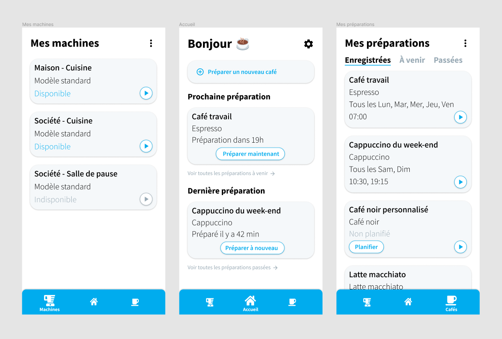
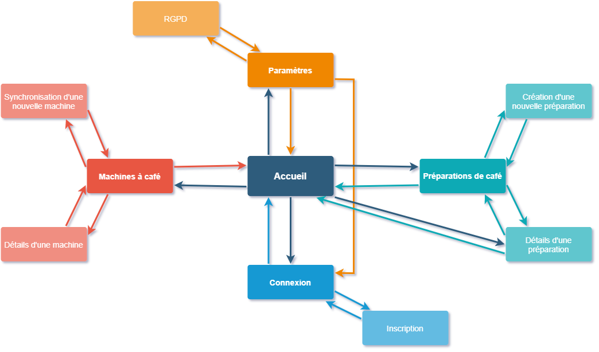

# Digikofy

Table des matières
- Présentation globale du projet
- Wireframes de l'application
- Architecture de l'application

## Présentation globale du projet

Le projet Digikofy est une application mobile Android. Cette application mobile permet de multiples interactions avec des cafetières compatibles et la gestion et planification de préparations de cafés.

L’objectif est de proposer à l’utilisateur une interface graphique lui permettant d’interagir avec les services que proposent Digikofy. Cette application dispose :
- De différents écrans pour afficher les diverses données et éléments d’interactions disponibles tels que les préparations de café, les machines à café, les boutons et listes
- D’un système de navigation entre les écrans de l’application
- De la possibilité de faire des requêtes HTTPS via une connexion Internet

Digikofy requiert au minimum la version 5 d'Android (Lolipop API 21).

## Wireframes de l'application

Voici les wireframes de l’application réalisés à l’aide de l’outil Figma :

Cette capture d’écran de l’outil montre trois wireframes des trois écrans principaux de l’application mobile Digikofy : l’écran d’accueil, l’écran des machines à café d’un utilisateur et l’écran des préparations de café d’un utilisateur.

L’écran d’accueil est composé d’un bouton permettant de démarrer une nouvelle préparation de café et met en avant la prochaine préparation à venir et la dernière préparation effectuée. C’est depuis cet écran qu’il est possible d’accéder aux paramètres de l’application.

L’écran des machines à café est composé d’une liste dynamique affichant les machines auxquelles l’utilisateur est synchronisé. Celui-ci peut appuyer sur une carte de machine pour accéder aux détails de cette dernière, modifier son nom ou désynchroniser la machine. L’icône d’action située au niveau du coin supérieur droit lui permet d’ajouter de nouvelles machines.

L’écran des préparations de café est composé d’une liste dynamique affichant les préparations auxquelles l’utilisateur est synchronisé. Cette liste peut être filtrée entre les préparations enregistrées, les préparations à venir et les préparations passées. L’utilisateur peut appuyer sur une carte de préparation pour accéder aux détails de cette dernière, modifier ses informations ou supprimer la préparation. L’icône d’action située au niveau du coin supérieur droit lui permet de créer de nouvelles préparations.

Ces trois écrans sont liés par une barre de navigation située sur la partie inférieure de l’écran de l’appareil de l’utilisateur. Cette barre de navigation est constamment affichée tant que l’utilisateur se situe sur l’un de ces trois écrans, mais n’est plus visible sur les autres écrans de l’application tels que ceux des créations ou de visualisation de détails de machines et de préparations.

## Architecture de l'application

La structure de l’application est basée sur une architecture MVVM (Model View ViewModel). Il s’agit d’une méthode qui permet, à la manière de l’architecture MVC, de séparer les vues de la logique et de l’accès aux données.

À l’ouverture de l’application, l’utilisateur atteindra l’écran de connexion s’il n’est pas connecté, ou l’écran d’accueil s’il est connecté. L’ensemble des écrans de l’application se découpe en cinq grands groupes :
- L’authentification, comprenant l’écran de connexion et l’écran d’inscription
- L’accueil, écran unique étant le point central de la navigation
- L’espace dédié aux machines à café, comprenant l’écran d’affichage de la liste des machines, l’écran d’affichage des détails d’une machine et l’écran de synchronisation de nouvelles machines
- L’espace dédié aux préparations de café, comprenant l’écran d’affichage de la liste des préparations, l’écran d’affichage des détails d’une préparation et l’écran de création de nouvelles préparations
- Les paramètres de l’application comprenant la liste des paramètres et l’écran du RGPD
